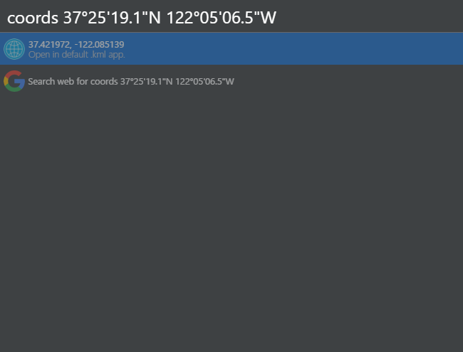

# Cerebro-open-coords

> [Cerebro](http://www.cerebroapp.com) plugin to open coordinates in your default kml app.

## Usage

 Just type ```coords``` followed by the coordinates in ```decimal degrees``` or ```degrees, minutes, seconds``` format into the cerebro box.

 Examples:

 ```
 coords 37.421972, -122.085125
 ```
 ```
 coords 37°25'19.1"N 122°05'06.5"W
 ```



 A kml file will be save to your documents folder, and then opened in your default kml app (e.g. Google Earth).

 
## Related

* [Cerebro](http://github.com/KELiON/cerebro) – Main repo for the Cerebro app.
* [Create-cerebro-plugin](https://github.com/KELiON/create-cerebro-plugin) – Boilerplate to creating Cerebro plugins.

## License
MIT © [5urpher](https://github.com/5urpher)